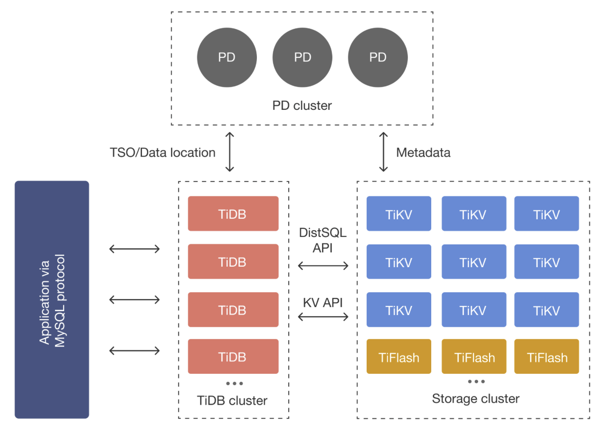

# README ALL

## 关于 finite state machine 设计思想

整个 store 被设计为一个有限状态机（FSM），它的输入是 message，这些 message 可能会驱动状态机进行状态变更，也可能会产生副作用，还可能会产生输出。

message 的输入来源有且仅有两个：由 server 层转发过来的 client message，由 ticker driver 发过来的 tick message。其它的 message 都是内部 message，且都是由 client message 和 tick message 触发的。

一个 store 中可以包含多个 peers，每个 peer 也按照 FSM 的思想进行设计。一个 peer 由三个 FSM 构成：peer FSM、raft FSM、app FSM。它们分别包装了 peer 层的状态、raft 层的状态、应用层的状态。在 tinykv 中，app FSM 是底层的 badger db。

在 6.824 中，raft 的驱动有两个：timer 和 raft msg。tinykv  把 timer 的 tick 用 tick msg 来表示，这样就把唯二的两个驱动统一为 msg。实际上，因为建模为 FSM，那么在没有输入 msg 的情况下，FSM 本身的 state 是绝不可能改变的。这就从理论上消灭了 raft 层、peer 层、app 层需要并发控制（例如加锁）的需求。另一方面，对于一个 FSM，它需要有一个接收输入 msg 的模块。在 tinykv 中，这个模块就是 raft worker（我称之为 peer worker）。它的职责是为每个 peer 调用它们的 peer msg handler 去 handle msgs，以及 handle raft ready。整个 store 只有一个 raft worker，它驱动所有 peer 的 server 层和 raft 层。 

由于 FSM 自己不会 spawn threads，所以一个设计重点就是把所有可能耗时较长的操作，比如 persist 操作，都进行异步操作。这些异步操作也不会另开线程，而是使用在初始化时创建的那些 workers。这些 workers 的特点是单线程地处理 tasks。这里肯定是有一个 tradeoff 的，有些情况下另开线程更 efficient，但是可能增大了并发控制的难度。

## 关于 batch system 的设计思想

tinysql 会把 SQL 拆分成关于不同 region 的 msg。对于 write，每个 msg 中包含一系列 mutations。这些 mutations 会被 tinykv 包装成 modifications。每个 modification 又会被 raft storage 包装成 put 或 delete operations。这些 operations 会被塞进一个 `RaftCmdRequest` 中。这个 request 会被 propose 为一个 log entry 的 data。所以在 execute 这个 request 时，会批量地处理这些 operations。

peer 处理：ready 中批量的 committed operations, raft msgs

整个 store 通过 raft worker 批量地处理所有 peers 的 msgs, readys。

发送 msgs 时，考虑到 network bandwidth，也是批量发送。包括 pipeline 等机制。

写入 disk 时，也是通过 write batch。

在 tikv 中，一次 process ready 的所有写入，还会被 wrap 到一个 write task 中，再集中写入。

处处体现着 batching 的思想。

TODO：添加更多关于 batch system 的资料。参考 tikv 源码解析。

## 关于 timer 机制

store 中有唯一的一个 physical timer，存在于 ticker driver 中。每当这个 timer tick 一下，ticker driver 就通过 router 向已知的所有 peers 均发送一个 tick msg。peer 收到之后，就驱动自己的 logical timer tick 一下，并且向 ticker driver 发回一个 tick response。ticker driver 收到这个 response，才会在注册表中保留对应的 peer，否则 ticker driver 会将 peer 从注册表中删除。这个 response 机制是为了检测 destroyed peers。

peer 有很多 time-driven events，就是一些需要周期性检查的 events。每个 event 设置的检查周期都用 logical ticks 来表示，ticks 的数值可以不一致。每当 peer 的 logical timer tick 一下，就检查是否到了某个 event 的 schedule time。如果到了，那么就执行相应的 event。

不仅 peer 层是这样驱动的，raft 层也是这样驱动的。raft 层的 election timer、heartbeat timer、step down timer 都是用类似的方式驱动的。

## 关于 worker 与 runner

首先对 worker 与 runner 进行区分。

worker 是一个 long running thread，它接收 task，然后执行 task，最后返回 task 执行的结果。在这个过程中，worker 本身的 state 是没有改变的。可以说 worker 是 stateless 的，或者说 worker 的 state 是 static 的。

runner 本身不是一个 long running thread，它也没有接收 task 和 执行 task 的功能。但是为了使用一个 runner，会将其与一个 worker 结合在一起。也就是说，worker 将 runner 包装成一个 long running thread，并提供接收 task、执行 task 的功能，runner 则做实际的工作。runner 也意味着它是 stateful，因为它一直在 running。

在 tinykv server 中，有这么些 workers 或 runners：

- snap runner
    - 考虑到 snapshot 通常很大，snapshot 的发送和接收被设计为 chunk by chunk。这就需要有一个 dedicated module 去管理 snapshot 的发送和接收。这样的一个 module 就是 snap runner。由于需要管理发送和接收，因此 snap runner 必定需要是 stateful 的。详细的参考 `关于 garbage collection, snapshotting, log compaction`。
- resolve runner
    - 考虑到 store 会进行迁移，即从某个 tinykv sever迁移到另一个 tinykv server，在发送 raft msg 给某个 store 时，我们需要根据 store id 知道 store 的 network address。当收到 resolve address 请求时，resolve runner 通过 scheduler client 向 scheduler 发送一个关于某个 store id 的 resolve address 请求，scheduler 则回复对应的 address。在拿到 address 之后，resolve runner 会将 (store id, store address) 存在一个 map 中。也因此，resolve runner 是 stateful 的。
- store worker
    - 由 ticker 驱动，周期性地做两个任务：
        - schedule 一个 `SchedulerStoreHeartbeatTask` 给 scheduler worker，由其进行 store heartbeat 的发送。由于 store 管理着所有的 peers，因此只有 store worker 才能得到所有 peers 的信息，故由 store worker 填写 store stats，然后由 scheduler worker 进行发送。
        - 向 peers 发送 `MsgTypeGcSnap` msg。peer 收到以后，清理 stale snapshot files。每个 snapshot 的 data 会被持久化到一个 snapshot file 中。当我们 apply 了一个 snapshot 后，之前的 snapshot files 都 stale 了，因此可以被清理。
- raft worker（实际上我将其命名为 peer worker）
    - 通过 store 中所有 peers 共用的一个 buffered channel，收集所有发往 peers 的 msgs。这些 msg 可能是由其它某个 store 发过来的 raft msg，也可能是由 client 发过来的 client requests。
    - 在收集 msgs 后，raft worker 根据 msg 的接收对象，即 region id，找到应该 handle 这个 msg 的 peer，然后将 msgs 分发给不同的 peers。
    - 在分发 msgs 之后，raft worker 还会通过调用 `HandleRaftReady` 检查每个 peer 的 raft FSM 是否有 deliver 给 peer FSM 的东西。这些东西被塞进一个 ready struct 中进行统合式地交付。如果某个 peer 有 ready，raft worker 就会 process 这个 ready，包括：execute committed operations、persist unstable log entries、send raft msgs、apply pending snapshot、update peer storage metadata。
    - 由于 ticker 也是通过发送 tick msg 进行驱动的，因此 raft worker 始终有机会调用 `HandleRaftReady` ，如此 raft FSM、peer FSM、app FSM 的状态就一定会被驱动。
- raft log gc worker
    - 接收 peer 发送过来的 `RaftLogGCTask`，负责对 on-disk log 执行 log compaction。
- region worker
    - 接收 peer 发送过来的 `RegionTaskGen`、 `RegionTaskApply`、 `RegionTaskDestroy`，负责generate snapshot、ingest snapshot、和清理 region data。
- scheduler worker
    - 负责接收 peer 发送过来的 `SchedulerRegionHeartbeatTask` ，发送 region heartbeat 给 scheduler，报告 region 的 leader、region size 等信息。
    - 负责接收 store worker 发送过来的 `SchedulerStoreHeartbeatTask` ，发送 store heartbeat 给 scheduler，报告 store 的 capacity, used size 等信息。
    - 负责接收 peer 发送过来的 `SchedulerAskSplitTask`，发送 ask split 给 scheduler，请求 scheduler 为分裂出的 region 分配 peers。为了 fault tolerance，一个 region 最少需要有三个 region replicas，且它们需要分布在不同的 store 上。每个 peer 都需要有一个 unique peer id，如此才能进行 routing。这样的分配任务只能由具有全局信息的 scheduler 完成。
- split check worker
    - 负责接收 peer 发送过来的 `SplitCheckTask` ，检查是否需要对 region 进行 split。如果需要，则把 split key 塞进一个 `MsgTypeSplitRegion` msg 中，发送给 peer。peer 收到以后，则会向 scheduler 发送一个 `SchedulerAskSplitTask`。

## 关于 router, transport, resolve worker/runner

关于 router：

一个 tinykv server 中存在一个 store，而一个 store 可能包含多个 peers，分别负责 handle 不同的 regions。当一个 msg 被 server 层捕获后，router 将这个 msg route 到 store 或者某个 peer。另一方面，当 server 中某个组件需要向其它组件发送 msg 时，有时候也会通过 router。简而言之，router 是用来 route msg 到 server 内部的组件。

关于 transport：

当一个 tinykv server 需要向另外某个 tinykv server 发送一个 raft msg 时，需要通过 transport。简而言之，transport 是用来发送 raft msg 到另一个 tinykv server 的组件。

关于 resolve worker/runner：

每个 store 有一个对应的 unique store id。由于 store 可以从某个 tinykv server 迁移到另一个 tinykv server，因此每个 store 的网络地址是可变的。为此，在发送一个 raft msg 到某个 tinykv server 之前，transport 会 schedule 一个 `resolveAddrTask` task 给 resolve worker。

resolve worker 在收到请求之后，调用 resolve runner 的接口，由其做实际的工作。resolve runner 通过 scheduler client 向 scheduler 发送一个关于 to store id 的 resolve address 请求。scheduler 则会回复这个 store id 所对应的 store 的 address。拿到这个 address 后，resolve runner 会将一个 (store id, store address) key value pair 写入到 resolve runner 维护的一个 map 中。下次 resolve runner 需要 resolve 这个 store id 的 address，则会从这个 map 中取。考虑到 store 迁移，resolve runner 会为每个 key value pair 赋予一个 lease。当 lease 过期后，即使 key 存在，也会重新向 scheduler 请求 resolve address。

## 一个 client request 是如何被 tinykv handle 的？

## 关于 garbage collection, snapshotting, log compaction

需要考虑两种情况：

- peer 发现可清理的垃圾的大小超过一定的阈值，于是在 peer 层进行 garbage collection 以及在 raft 层进行 log compaction。
- leader 在发送 append entries 给某个 follower 时，发现需要发送的一部分 log prefix 已经被 compact 了，于是向 peer storage 请求生成一份 snapshot。待 snapshot 生成完毕后，leader 将该 snapshot 发送给 follower。follower 收到以后，在 raft 层进行 log compaction，然后将收到的 snapshot 作为 pending snapshot 交付给 peer 层。peer 收到以后，执行 apply snapshot。

对于第一种情况：

ticker driver 通过 router 发送一条 tick msg 给 peer worker。假设此时刚好到了 raft gc log tick 的 schedule，那么就执行 `onRaftGCLogTick` 检查可清理的垃圾的大小是否超过了设定的阈值。tinykv 这里只检查了可清理的 raft log 的长度是否超过了设定的阈值，实际上可以检查更多的垃圾类型。可清理的 raft log 指那些尚未被 compact、且已经被 executed 的 raft log。

如果可清理的 raft log 的长度超过了阈值，那么就向 raft 层 propose 一个 compact log admin cmd。待其被 commit 后，再执行 log compaction。然而在我的实现中，并没有采用这种方法，而是按照 raft 论文中所述，不通过 raft 层共识而直接执行 log compaction。由于被 compact 的 log 早就已经被 executed 了，因此每个 peer 单独做 log compaction 并不会影响 app FSM。而只要一个操作不会影响 app FSM，我们就可以安全地跳过 raft 层而独立地执行它。

这里的 log compaction 只是把 raft log 的 metadata 进行更新，而没有 touch disk 中的 raft log 的 data。这里对 metadata 的更新包括：对 cache 在内存中和 disk 中的 peer storage 的 `RaftApplyState` 中的 `RaftTruncatedState` 进行更新，对 raft 层 cache 在内存中的 raft log 进行更新。需要指出的是，在 tinykv 的设计中，peer 层与 raft 层进行交互的唯一途径是通过 raw node，而 raw node 只提供了 `Step` 和 `Advance` 两个接口用于 peer 层向 raft 层直接发送通知。所以我设计了一个新的 message 类型 `MessageType_MsgCompact` 用于要求 raft 层立即对 cache 在内存中的 raft log 进行 compact。

在 metadata 更新完之后，peer 会 schedule 一个 `RaftLogGCTask` task，并将其交付给 raft log gc worker。gc worker 在收到 task 之后，会异步地执行 log compaction，对 disk 中的 raft log 进行真正地删除。当然，由于底层的 storage engine 是 badger db，而它是一个 LSM tree based database，所以它也只是通过 append 一个 delete log，而并不会立即做删除。

对于第二种情况：

leader 在发送 append entries 给某个 follower 时，通过比对 next index 和 first index 发现需要发送的一部分 log prefix 已经被 compact 了，即这些 cache 在内存中的 log 已经由于 leader 的 log compaction 被 truncate 了。当然，此时 on-disk log 可能还没有被清理。leader 转而尝试发送 install snapshot 给这个 follower。

leader 于是调用 peer storage 的 `Snapshot` 接口请求生成一份 snapshot。在该接口被调用时，它会检查当前是否正在生成 snapshot，如果正在生成则会尝试从对应的 channel 中获取所生成的 snapshot。recv channel 的操作被 wrap 在一个 select-with-default clause 中，因此即使 channel 中没有 snapshot，也不会 block。如果尚未开始生成 snapshot，则会 schedule 一个 `RegionTaskGen` task，并将其交付给 region worker。为什么取名为 region worker 呢？因为这个 worker 专门处理 region data 相关的 tasks，包括 generate snapshot, apply snapshot, 以及 destroy region data。

region worker 收到 task 之后，开始执行 snapshotting，异步生成 snapshot。snapshot 生成完毕之后，region worker 会将该 snapshot 向 snap manager 注册。每个 snapshot 有一个对应的 unique snap key，其由 region id, snapshot index, 以及 snapshot term 组成。注册之后，region worker 把 snapshot 的 metadata 推入 channel 中。由于这个 channel 是一个 buffered channel，因此这个 send channel 操作不会 block。

leader 在之后尝试发送 install snapshot 给这个 follower 时，又会调用 peer storage 的 `Snapshot` 接口，此时便会从 channel 中拿到 snapshot 的 metadata。leader 将它塞入一个 install snapshot msg 中，准备交付给 peer。peer 收到这个 msg 后，与发送其它 raft msg 一样，通过 transport 发送它。transport 在发送一个 msg 之前，会检查 msg 中是否含有 snapshot metadata。如果有，则表明这是一个 install snapshot msg，则会 schedule 一个 `sendSnapTask` task 给 snap runner。

snap runner 收到 task 以后，首先利用 msg 中的 snapshot metadata 构造出 snap key，再根据这个 key 通过 snap manager 拿到存储在 disk 中的 snapshot data。snap runner 随后与将要接收这个 snapshot 的 follower 构建一个长连接，以 chunk 的形式分块发送 snapshot data。

follower 的 `Snapshot` service 接口被调用时，会 schedule 一个 `recvSnapTask` task 给 snap runner。snap runner 首先向 snap manager 注册这个 snapshot，之后持续地接收 leader 发送过来的 chunks。在接收完毕之后，follower 把 snapshot metadata 塞进一条 raft msg 中，通过 router 发送给对应的 peer。这个 msg 就是一条 install snapshot msg。

peer 收到以后，会把这个 msg 转发给 raft 层。raft 层接收到以后，会判断是否能够 install 这个 snapshot，例如 follower 当前是否真正地 lag behind leader’s latest snapshot。如果所有的判断都通过，那么 follower 就会根据这个 snapshot 在 raft 层做 log compaction，即 truncate in-mem raft log，并把该 snapshot 作为一个 pending snapshot，通过 ready 交付给 peer 层。当 peer 收到 pending snapshot 之后，schedule 一个 `RegionTaskApply` task 给 region worker。

region worker 收到 task 以后会执行 apply snapshot，强制要求 app FSM，即 badger db，去 ingest 这个 snapshot，即将 db 中的 key value pairs 替换为 snapshot 中的值。由于 app FSM 在 apply snapshot 完成之前不能 apply 其它的 operations，因此 peer 层在 schedule 这个 `RegionTaskApply` task 给 region worker 之后，会 block waiting 这个 task 完成。

在 ingest snapshot 完毕之后，peer 更新各种 metadata，包括 `RaftLocalState` 和 `RaftApplyState`，随后 schedule 一个 `RaftLogGCTask` task 给 gc worker，由其异步地对 on-disk log 执行 log compaction。

这里需要注意，ingest snapshot 和 update metadata 都涉及到 write disk 操作。然后 tinykv 并没有提供同步写入它们的接口。也就是说，可能在 ingest snapshot 之后，在 update metadata 之前，server crash 了。tikv 对这个问题的解决方案是，把这些 write disk 操作都塞进一个 write task 中，然后统一地进行 write，如此就可避免 write out of sync。但是我目前并没有在 tinykv 中看到类似的接口。

## 关于 region split

一些 split 策略：

因为 region split 的策略是把当前的 range 切分成含 key value pairs bytes 大小相当的两份，所以可以通过 region start key 和 region end key 来找到 sibling regions。

然后这里 region split 不涉及 local 的 data migration，这是因为虽然我们分了 peer，但这些可以说都是内存中的东西，都是 metadata。实际上 engine 只有 raft db 和 kvdb 两个。所有的 peer 都是通过这一个 engine 做 disk io 的。所以不涉及 migration。但是之后需要 gc stale 的。

## 为什么 service 的 context 中只包含一个 region id

context 中的 region id 为什么只有一个？

好像是这样的：tinysql 会把 client 的 request 拆解成多个 batches，每个 batch 的 size 是有限的。另一方面，每个 batch 中的操作都属于同一个 region，所以发过来的 rpc 的 context 中的 region 只需要一个 region id。

如果一次 client 的操作涉及到多个 regions，那么它们会被拆解成多个 batches，然后分开发送。

这个 region id 由谁确定？

## 其它值得提的东西

- `Node` struct：封装了 raft store 的创建、bootstrap、停止逻辑。
- `RawNode` struct：封装了 peer 层与 raft 层的交互接口。
- scheduler client：用来和 scheduler 交互。
- raft client：用于发送 raft msgs 给其它 tinykv servers。
- global context: 不同 workers 需要的东西不同，为了避免给不同的 workers 写不同的创建接口，于是直接把所有 workers 需要用的东西都塞进 global context 中，然后传给不同的 workers。worker 再各取所需。
- 为什么使用 b tree 作为 region start key → region metadata 这个 map 的 backing data structure？因为 b tree 支持高效的 range 操作。
- handler 是 stateless 的东西。在代码中出现了 service handler、peer msg handler 等 handlers。这些 handlers 之所以叫 handler，就是因为它们是临时创建的、stateless 的东西。
- 时刻思考 write sync 和 crash consistency。需要一起更新的东西都需要通过一次 txn 写入进行更新，否则可能会 out of sync，导致 restart 后 consistency 被破坏。
- 哪些 peer 层的操作需要经过 raft 层共识？
    - 首先，一个最基本的原则是：touch app FSM 的操作都需要经过 raft 层共识。包括对于 key-value db 的 write operations（Put, Append, Delete 等）、split region、add/remove peer 等 config change 操作。
    - 对于 key-value db 的 read operations（Get, Scan 等），如果需要线性一致性，且没有 read index, lease read 等优化，那么 read operations 需要经过 raft 层共识。
    - 对于 compact log，由于没有 touch app FSM，而只是 compact raft log，因此不需要经过 raft 层共识。
    - 对于 transfer leader，它只是 change raft 层的 leadership，并没有 touch app FSM，因此也不需要经过 raft 层共识。
- 是否需要 WAL？这个需要看 storage engine 的设计以及系统整体的 persistence 设计。
- prevote:
    
    
    
- automatic step down:
    
    
    
- 

## 一些编程上的东西

- golang 的 embed an anonymous field in a struct，使得你可以通过 wrapper 去调用 embedded field 的东西。
- 使用宏来减少代码复用。很多时候，不同的函数会复用同一块代码，然而这块代码又不能被 wrap 到一个函数中。例如由于 RAII 等机制，当 wrap 进函数中时，这块代码就不能发挥原来的作用。此时就可以用宏。
- 

## 关于 TSO 服务

为什么需要 TSO？

[分布式事务中的时间戳](https://ericfu.me/timestamp-in-distributed-trans/)

其实就是为了支持 MVCC 的 snapshot 

最重要就是为了支持 txn 的 timestamp

TODO: lamport lock，别人的笔记

[https://www.codedump.info/post/20220703-weekly-21/](https://www.codedump.info/post/20220703-weekly-21/)

## 关于 column family

TinyKV 的另一个重要 feature 是：支持 column family。为了解释 column family，首先需要了解 key-value store 和 relational store，store 即 database。

在 relational store 中，数据库被抽象成表 (table)，每个表由一系列 row 组成，每个 row 则由一系列 column 组成。在存储的时候，这些 column 可以连续存储，也可以分开存储。

在 key-value store 中，数据库被抽象为一个 hash table，由一系列 key-value pair 组成。通常来说，value 的存储形式是字符串或字节串，即一个 key 对应的 value 是连续存储的。

很多时候，一个 key 对应的 value 由很多 field 组成。如果使用 relational store 的概念，key 可以看作 row，value 中的 field 则看成 column。但由于 field 是连续存储的，在 fetch 时，一个 key 对应的 value，即所有 field 都必须被整体 fetch。（这是因为，有些 field 的长度是可变的，不能预知某个 field 的 offset，所以必须整体 fetch）

显然，这会带来性能问题。因为对于某些 query，其只关注某个 key 的某些 field。如果有一种组织方式，能够将一个 key 对应的不同 field 进行分组组织，则在 fetch 时，只需 fetch 某一组 field，而不需要 fetch 所有 field。

column family 即是这样一种组织方式，其将 relational store 中的 column 映射到 key-value store 中的 field。key 对应的 value，即一连串 field，以 column family 为单位进行存储。

## 关于 peer 的创建

## 关于初始化

关于 peer 的操作，我们要考虑到 dynamic partitioning，也就是说一个 node 中一开始是一个 peer 都没有的

## 关于 restart

谈一下为什么 raft 层需要 persist committed index 以及 server 层需要 persist applied index。这个完全就是和 persistence 机制有关了。

## 关于 transfer leader

leader transfer：

这里要提一下 tinykv 中 server 层和 raft 层的通知机制。有两种，一种是 server 通过调用 handle raft ready 间歇地主动询问 raft 层有没有需要处理的。

另一种是 server 主动 propose。

还有一种是直接调用 raw node 的 step。例如 transfer leadership 就是通过直接调用 step。

关于 raft 模块如何 handle transfer leader msg，参考 etcd raft 库的相关实现。

提一下为什么 transfer leadership 的 motivation 是什么？

比如 leader 要 repair，比如 leader 运行时间过长要定期下线维护。比如为了 config change 做准备。

关于在只有两个节点时如何进行 config change，以及它的风险（看下面）。

这个是一个重点。

关于 transfer leader 和 add, remove peer, 这个要一起讲。

## 关于 config change

考虑提到 scheduler 的 load balance。

config change 包括：

key to region map, peer to store map,

其实是 一个 peer 管理一个 region 的 replica。一个 raft group，或者说一个 peer group 管理一个 region cluster。

这里与 6.824 的区别是，这里是一个 peer 只管理一个 region，那边是一个 peer 可以管理多个 regions。实际上在 6.824 中，应该是一个 store，而不是一个 peer。所以实质还是 peer to store。既然是这样，那么就没有必要说 store to server，因为这里就被 peer to store 囊括了。当然也可以提一下。

搞清楚：config change 这些 cmds 是怎么 generate 的。

注意这些 admin cmd 都是 admin 主动调用的，所以不会通过 tick 来驱动。

实际上应该是，当然这里每个 server 是通过 scheduler 才知道 new config 的。

但是在 lab 就只是 tester 直接调用相应的函数来给 peer 发送这样的 admin cmd。

然后 scheduler 通过 heartbeat 发现需要调度，然后就把某个 peer 从某个 store 上调到另一个 store 上。所以这里就需要 remove peer 和 add peer。然后如果刚好 remove 的是 leader，那么就需要 transfer leader。当然，这只是一种场景，但是因为它囊括了这些所有，我就单独拿出来讲。

## 关于 cluster id, store id, peer id, region id

为什么需要 region id 和 peer id 是唯一的呢？region id 我知道，肯定需要唯一，且肯定需要经过 scheduler 全局 allocate。但是 peer id 呢？

peer id 需要全局分配，是因为如果要使用 raft group 做对某个 region 的 replicate，我们不能只分配一个 peer，我们至少要在不同的 store 上分配三个。

另一方面，不同的 store 上的关于同一个 region 的 peer 可能同时触发 split，这时如果不经过 scheduler 中心式地调配，对于 peer 的分配会有冲突。

然后得到分配的之后，需要经过 raft 层统一共识。这是肯定的，因为修改了 state machine。

当然，这里具体的处理我还是有点模糊，但不影响我做 lab。

## 关于 scheduler 的 balance

config change 和 transfer leader 都是 scheduler incur 的。scheduler 里面有很多这样的 balancer，分别做不同的 balance 工作。

需要提一下 region balance 的方法。思想还是类似我在 6.824 实现的那个。但是会有很多限制。例如 peer 的 store 数量，本次 balance 是否 valuable，通过 size diff 来判断。

region balance 的其中一个限制是不能把同一个 region 的不同 replicas 放在一个 store 中。

关于 scheduler，为什么需要调度？如何调度？有哪些要求和 hint？

[三篇文章了解 TiDB 技术内幕 - 谈调度](https://cn.pingcap.com/blog/tidb-internal-3)

## 关于 region merge

为什么需要 merge region，应该主要是为了降低管理的开销。

[TiKV 源码解析系列文章（二十一）Region Merge 源码解析](https://cn.pingcap.com/blog/tikv-source-code-reading-21)

## 关于 region epoch

关于 region epoch，目前还有点模糊。但应该就是保证 send 和 recv （当然是抽象的意思）时的 essential state 是 identical 的。

region epoch 另一方面可以作为 client 和 server 的对峙。虽然也可以不做，只要 sever 还在 serve 这个 region 就行。但是这里为了保险，肯定是对峙一下比较好。

region epoch 的另一个用处就是让 scheduler 来判断 stale heartbeat。例如由于网络 delay, reorder, partition 等。

## 关于 pipeline 和 flow control

tikv 如何实现 pipeline 和流量控制

pipeline 就是一种乐观机制，leader 一直发，假定会被 accept，所以根据这次发送的 append entries 去更新 next index，然后再去发下一个 append entries

一旦被 reject，那么就 rollback next index。

当然不能一直发，因为 network bandwidth。所以需要流量控制

所以 pipeline 和流量控制是配套的

## 关于 tinykv server 的分层式设计

再根据 lab 的这张图分析 tinykv 的架构

tinykv 大概三层：

- service handler：暴露出 key-value database 的接口给 client 调用。这里的 client 指 tinysql。
    - 分两种，一种不经过 txn，即 raw api；另一种经过 txn，即 txn api。支持 txn api 的，是 transaction 和 mvcc 相关的东西。
    - 还有一个相对独立的组件 coprocessor，用来分担 tinysql 的计算压力。
- storage：暴露出 key-value store 的接口给 service handler 调用，即 get, put。
    - 两种实现，一种是单机版的 store，即 standalone storage。另一种是分布式的，基于 raft 的，即 raft storage。
- storage engine: 暴露出存储的接口给 storage 层调用，处理数据落盘。当然也可以是存在 memory 中。
    - 这里通常是调用某种底层存储引擎，它只关注存储，不需要理解上层的东西。例如由 lsm-tree 实现的一个数据库。它主要就是需要保证 persistence 操作维护了 crash consistency，当然也有效率的考虑。

## 关于 tinysql, tinykv, tiny scheduler 三者的关系

参考说明 tidb 的架构，即 client, tidb, tikv 几者的关系。

[TiDB 整体架构](https://docs.pingcap.com/zh/tidb/stable/tidb-architecture)

## 关于 store, peer, region, raft group

## 关于 engine

## 关于 tinykv 的事务模型

[TiKV 事务模型概览，Google Spanner 开源实现](https://cn.pingcap.com/blog/tidb-transaction-model)

[Percolator](https://tikv.org/deep-dive/distributed-transaction/percolator/)

[TiKV 源码解析系列文章（十二）分布式事务](https://cn.pingcap.com/blog/tikv-source-code-reading-12)

然后就是根据之前的 notability 的录屏来总结 lab4。

[Project 4  Transaction](https://www.notion.so/Project-4-Transaction-3ffdb1169d4e4125a6c23e808d00db45) 

txn 需要客户端和 sever 端共同 co-op 

## 关于 raft 层做不做 send msg 和 persist

关于 ready。为啥有这样一个东西，一是考虑到 batch 的关系。而是考虑到 raft 层本身不发 msg，不能自己独立做 persist，所以需要把很多东西交给 server 层来做。这是 etcd 自己的设计，这是因为 etcd 把 raft 独立成一个可以被大家通用的一个库了，所以它把很多东西的设计都不做成紧耦合，而是把更多选择交给用户，及应用层来设计。

考虑这些：

1. 由于etcd的Raft库不包括持久化数据存储相关的模块，而是由应用层自己来做实现，所以也需要返回在某次写入成功之后，哪些数据可以进行持久化保存了。
2. 同样的，etcd的Raft库也不自己实现网络传输，所以同样需要返回哪些数据需要进行网络传输给集群中的其他节点。

其实究竟让谁来实现这些东西，就看你想做什么。比如你想做一个 raft 库，那么你肯定不应该自己实现很多东西，不然库的用户想修改就难了。而如果你只想自己做一个基于 raft 的服务，那么把 raft 层可以做的东西都放在 raft 层，那么 server 层需要做的杂事就少了，那么 server 层的逻辑就可以比较精炼了。

## 关于 gRPC

在 TinyKV 的设计中，user 与集群，集群与集群之间的通信都是使用 RPC。TinyKV 项目选择使用 gRPC (Google RPC) 作为 RPC 框架/协议。一个RPC协议包含两个部分：序列化协议，传输协议。

[谁能用通俗的语言解释一下什么是 RPC 框架？](https://www.zhihu.com/question/25536695/answer/221638079)

gRPC 的序列化协议使用的是 Protocol Buffer 序列化协议，传输协议则使用的是 HTTP 协议。前者，是我们在项目中会接触到的。

[Introduction to gRPC](https://grpc.io/docs/what-is-grpc/introduction/)

Protocol Buffer 协议提供了一个 proto 文件格式和 protoc 编译器。通过在 proto 文件中定义 一系列 message，即 RPC request 或 response，再把这些文件输入给 protoc 编译器进行编译，会生成对应的 go 文件，包含 RPC request 和 response 的定义，可以被项目直接使用。

[Overview | Protocol Buffers | Google Developers](https://developers.google.com/protocol-buffers/docs/overview)

就像计算机网络中的其他协议一样，gRPC 会作为一个模块/软件运行在集群中的每一个 node 中。可以将 node 中运行的 gRPC 模块也看作一个 server，即 gRPC server。这个 server 可以自动接收 RPC request，但它不知道调用哪个 RPC handler。因此，需要先调用 gRPC 的接口，将我们所实现的 TinyKV 的 handlers 注册到 gRPC server。当然，这一部分，不需要我们自己写代码，`kv/main.go` 文件已经完成了这部分功能。